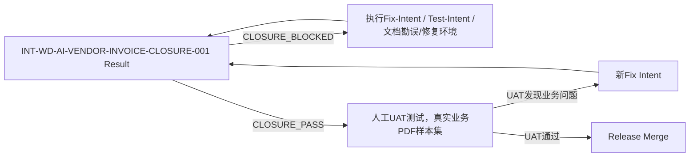

# INT‑WD‑AI‑VENDOR‑INVOICE‑CLOSURE‑001.md
> **Implementation Closure / Release Readiness Review**
> 版本：1.1（修订4项契约收口，正式冻结版）
> 状态：FROZEN（验收基线，本Intent只审计，禁止擅自修改业务代码）
> 适用模块：`ai_vendor_invoice`（Odoo18）
> 前置条件：Sprint1‑Foundation、Sprint2‑AI‑Review、Sprint3‑BillClosure 全部实施完毕；代码位于工作树，尚未合并main；SRS v1.3.4 / DDD v1.2 / TDD v1.4.2 / Coding‑Contract(GATE‑01~GATE‑15) **冻结，作为唯一验收基线**。

## 1. Intent 目标
**本Intent不做新功能开发，不做随手bug修复。**
以冻结文档作为唯一真值，对当前最终代码库做**全量反向核查、运行时验证、产出可追溯矩阵、缺陷分类归档**。

> 重要约束：未经单独 Fix/Test Intent 授权，**禁止修改正式业务代码、现有正式测试代码及冻结文档**。
> 本 Intent 仅允许创建**不进入正式模块源码树、不进入正式测试套件的临时诊断脚本**，用于环境探测和证据采集。
> 临时诊断脚本不得用于弥补正式测试缺失，也不得作为 `TEST_GAP` 的关闭依据。
> 禁止仅依赖Sprint工作报告，必须直接读取磁盘上最终源码、测试代码、xml安全配置、cron数据、manifest；根据类型选择静态扫描或真实Odoo运行时测试获取证据。

## 2. 验收基线（不可变更参考源）
1. SRS v1.3.4
2. DDD Domain‑Design‑Doc v1.2
3. TDD v1.4.2（T‑001 ~ T‑029）
4. Coding Contract GATE‑01 ~ GATE‑15
5. 模块：`addons/ai_vendor_invoice` 磁盘当前代码（worktree现状，不假设已提交git）

## 3. 交付物清单（全部输出到文档，不要改业务代码）
执行完成，必须产出4类产物：
1. 逐条核查报告：SRS、DDD Invariants、TDD用例、Coding‑Contract Gate 核查结果
2. Traceability Matrix（可追溯矩阵，Markdown表格）
3. 缺陷分类清单（A/B/C‑A/C‑DOC/C‑AMBIGUOUS/D/E五类细分，不就地修复）
4. 发布就绪结论：`CLOSURE_PASS` / `CLOSURE_BLOCKED`；如果Blocked列出阻塞项编号；若存在环境问题输出`Environment Blockers`

## 4. 核查执行步骤

### Step 1：SRS需求逐条反向核查
对SRS中每一条业务需求，输出固定格式：
```
SRS Requirement: {复制SRS条目原文}
- 代码实现在哪里：{文件路径}::{类/方法/字段}
- 对应什么测试：{test文件名}::{test函数名}
- 测试是否实际执行：{行为型需求提供运行时证据；静态架构约束可提供源码/AST/manifest扫描证据}
- Result: [PASS | FAIL | PARTIAL | NOT_IMPLEMENTED | BLOCKED_BY_ENV]
- Evidence note: {简短证据备注}
```

### Step 2：DDD领域不变量 Invariant逐条核查
```
DDD Invariant: {DDD原文不变量描述}
- 代码证据：{文件、方法、约束、model字段、sql约束、record‑rule；静态不变量允许源码扫描证据，行为不变量需要运行证据}
- Result: [PASS | FAIL | BLOCKED_BY_ENV]
- Evidence note:
```

### Step3：TDD T‑001 ~ T‑029 逐条核查
```
TDD Case ID: T‑XXX
- TDD描述：{原文}
- 代码证据：{实现位置}
- 验证证据：
  - 行为型不变量：必须提供真实运行时测试证据；
  - 结构型/静态架构不变量：允许使用源码扫描、AST、manifest/XML检查或verify.py作为直接证据；
  - 同时存在静态和运行时验证条件时，两者均需提供。
- Result: [PASS | FAIL | BLOCKED_BY_ENV]
- Evidence note:
```

### Step4：Coding Contract GATE‑01 ~ GATE‑15 逐条核查
```
GATE‑XX：{Gate原文描述}
- 静态扫描证据：rg/grep/AST/verify.py结果摘要（适用于架构约束）
- 运行时证据（如适用）：单元测试/verify.py输出（适用于行为约束）
- Result: [PASS | FAIL | BLOCKED_BY_ENV]
- Evidence note:
```

## 5. 必须执行的运行时测试集合（**本列表内条目强制要求真实运行拿到证据，不接受静态分析判定PASS**）
> 下面项目**不允许“看代码觉得没问题”**，必须执行Odoo环境拿到日志/输出作为证据：

1. 模块安装/升级测试
    - 命令：`odoo-bin -u ai_vendor_invoice --stop-after-init`；验证无安装报错、cron、group、record‑rule全部加载生效
2. 全部 Unit Tests
3. Integration Tests
4. **Concurrency tests：并发创建Vendor Bill；验证SELECT FOR UPDATE行锁、不会重复生成bill**
5. Stale‑Worker / Queue‑Job 测试
6. Transaction rollback测试：异常场景事务回滚，确认不存在孤立残留account.move
7. ACL / Record Rule权限测试
8. Multi‑company隔离测试
9. Secret泄漏测试：日志、异常信息不输出provider api key / secret
10. Bill‑Creator幂等测试：task已经生成bill，再次调用入口拒绝重复创建
11. `verify.py` 全部门禁脚本完整执行，输出门禁结果摘要

> 输出每一类测试：执行命令、关键日志片段摘要、是否通过。
> 若因环境故障（数据库、队列runner、依赖缺失等）无法完成运行，标记结果`BLOCKED_BY_ENV`；**BLOCKED_BY_ENV不等于FAIL，也不得判定PASS**，最终结论强制`CLOSURE_BLOCKED`，归入Environment Blockers，不属于产品实现缺陷。

## 6. Traceability Matrix 可追溯矩阵输出
输出完整Markdown表格：

| Requirement / Contract ID | Implementation Location | Test / Verification | Result |
|---|---|---|---|
| SRS‑xxx | `path/file.py::method_name` | `test_file.py::test_xxx` | PASS |
| DDD‑INV‑xx | `path/file.py` | `test_xxx` | PASS |
| T‑004 | `services/parse_service.py` | `test_stale_worker` | PASS |
| GATE‑05 | `models/import_parse_attempt.py` | test_unique_constraint | PASS |

> 覆盖SRS全部条目、DDD全部不变量、TDD全部T‑001~T‑029、全部GATE‑01‑15。
> 静态架构约束列填写静态扫描/verify.py，行为约束填写对应测试函数。

## 7. Defect 缺陷分类规则（发现问题**不修复，只归类记录**）
所有发现缺口、偏差、问题，归入下面类别，输出缺陷清单列表；**任何未完成根因判定的C类问题不得进入CLOSURE_PASS**。

- **A. IMPLEMENTATION_DEFECT**
  冻结文档设计正确，代码实现存在错误。
  > 处置：需要新建独立 `FIX‑INT‑XXXX` Intent才允许修复；本Closure不改动代码。

- **B. TEST_GAP**
  代码逻辑看起来正确，但缺少正式测试证明该行为；临时诊断脚本**不能用来消除此缺口**。
  > 处置：新建独立 `TEST‑INT‑XXXX` Intent补充正式测试；本Closure不写正式测试代码。

- **C. DOCUMENTATION_DRIFT**
  代码行为与冻结SRS/DDD/TDD文档不一致。
  必须进一步标记子分类：
  - **C‑A**：经分析确认冻结文档正确、实现偏离 → 按阻塞性 IMPLEMENTATION_DEFECT 处理；
  - **C‑DOC**：经分析确认实现符合上位业务基线，但冻结技术文档存在勘误 → 阻塞 Closure，必须先完成文档勘误/重新冻结；
  - **C‑AMBIGUOUS**：无法判断哪一方正确 → 阻塞 Closure，提交人工决策。

- **D. NEW_REQUIREMENT**
  当前冻结基线文档**完全没有定义该行为**，属于额外新增诉求。
  > 处置：不修改代码；记录进入Product Backlog，不阻塞本次Closure。

- **E. OPTIMIZATION**
  功能行为符合冻结设计；只是性能、写法、可维护性有改善空间，不影响功能正确性。
  > 处置：不阻塞Closure PASS；记录，后续如需要，单独建立 `INT‑XXX‑HARDENING‑001`。

> 示例输出条目：
> - ID: CL‑DEF‑001
> - Category: B.TEST_GAP
> - Description: 缺少multi‑company bill creator正式运行时测试
> - Baseline‑ref: SRS‑19 Multi‑Company Isolation
> - Recommendation: Create dedicated Test Intent

> 环境问题单独列表：Environment Blockers，不属于A‑E缺陷分类。

## 8. 代码质量审查（只读报告，禁止自动重构）
完成核查与缺陷清单之后，执行代码质量审阅；**只输出问题清单，禁止自动修改代码**。
审阅维度清单：
1. 重复代码
2. 死代码 / 未使用import、变量
3. 异常处理完整性
4. 日志规范：级别、敏感信息过滤
5. `sudo` 使用风险点
6. ORM/SQL写法；识别潜在N+1查询
7. 事务边界合理性
8. Odoo开发编码规范符合性
9. 测试可维护性问题

输出清单格式：`File:xxx.py；Issue描述；Severity[LOW/MED/HIGH]；Recommendation（只建议，不修改）`

## 9. Closure 最终结论
输出二选一结论：
1. `CLOSURE_PASS`：
   - A类实现缺陷数量 = 0
   - 阻塞性B类测试缺口 = 0
   - 全部C类Documentation‑Drift已经完成根因判定，不存在未解决C‑A / C‑DOC / C‑AMBIGUOUS
   - 不存在Environment Blockers
   - B非阻塞、D、E记录归档；可以进入人工UAT阶段。

2. `CLOSURE_BLOCKED`：
   - 存在A类缺陷 / 阻塞B类缺口 / 未闭环C类漂移 / Environment Blockers
   - 列出全部阻塞项编号，说明必须完成对应Fix/Test Intent、文档勘误或者环境修复，才可以继续后续流程。

> 重要：Closure通过≠项目发布；Closure通过只代表**代码按照冻结设计完整实现**；后续必须执行人工UAT。

## 10. 后续流程指引（写在报告末尾）


人工UAT输入样本集合参考（UAT不在本Intent范围，作为备注）：
- 正常标准供应商账单
- 多不同供应商
- 多币种
- 含税率/不含税率
- 无明细头账单
- 多行费用明细
- AI低置信度解析结果
- AI解析失败样本
- 多invoice合并PDF
- 重复账单样本
- 异常金额样本

## 11. 本Intent硬性约束（强制执行）
1. ❌ **禁止修改产品业务代码、正式测试套件、冻结文档**；只允许创建不在正式源码树内的临时诊断脚本用于证据采集。
2. ❌ 不允许边验收边修复发现的缺陷；缺陷只分类记录，修复必须由独立Intent授权。
3. ❌ 不允许仅依赖Sprint总结报告；所有证据来源必须为磁盘源码+Odoo运行输出 / 授权静态扫描工具。
4. ✅ 所有判定为PASS的条目，必须附带可追溯证据片段。
5. ❌ `BLOCKED_BY_ENV` 既不能判FAIL，也不能判PASS，直接置整体`CLOSURE_BLOCKED`。

---
