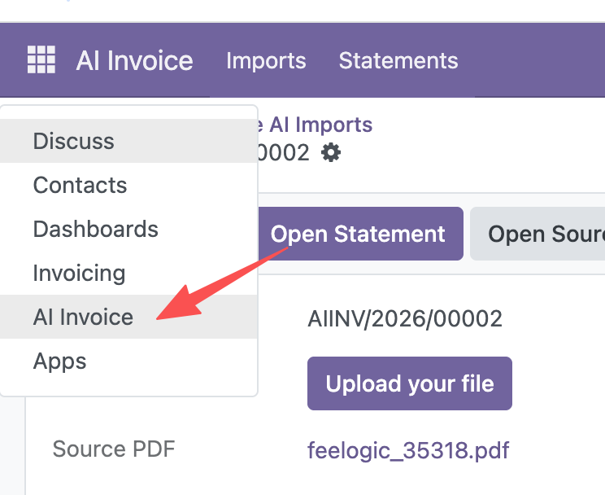
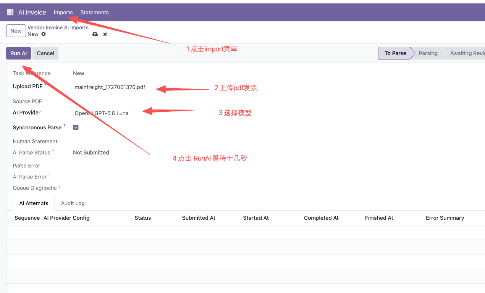
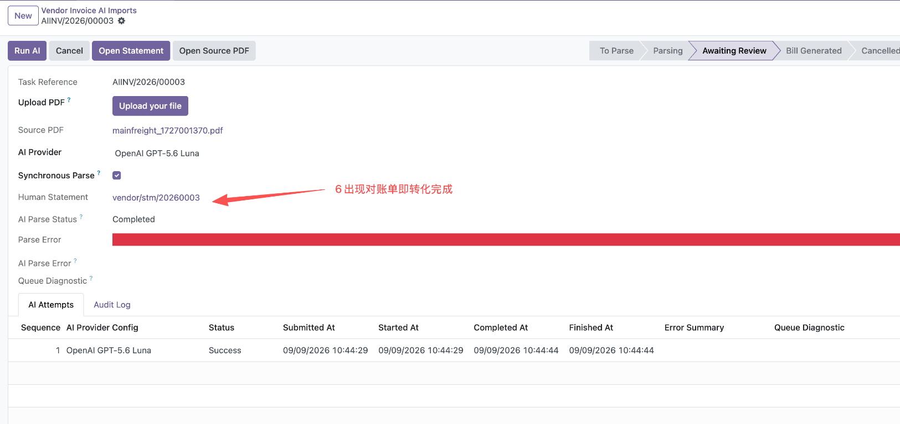
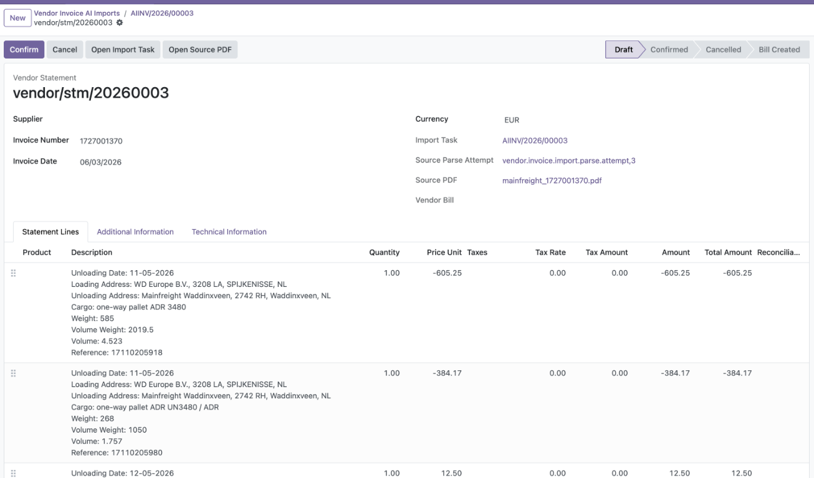

# AI Invoice 用户操作手册

本文档说明如何使用 **AI Invoice** 将供应商发票 PDF 识别为 Vendor Invoice Statement，并进行人工核对。

## 1. 进入 AI Invoice

登录 Odoo 后，点击左上角应用菜单，在应用列表中选择 **AI Invoice**。

AI Invoice 应用包含两个主要菜单：

- **Imports**：创建和查看 AI 发票导入任务；
- **Statements**：查看识别后生成的供应商发票单据。

## 2. 创建发票导入任务

1. 点击顶部的 **Imports**。
2. 点击 **New** 创建新的导入任务。
3. 在 **Upload PDF** 字段上传供应商发票 PDF。
4. 确认 **AI Provider**，选择要使用的 AI 模型。
5. 根据需要设置 **Synchronous Parse**：
   - 勾选：等待当前页面完成解析；
   - 不勾选：通过后台队列执行解析，页面不会一直等待。
6. 点击 **Run AI** 开始识别。

### 识别前检查

开始识别前，请确认：

- 上传的是原始供应商发票 PDF；
- PDF 内容清晰且没有密码保护；
- AI Provider 已配置并处于可用状态；
- 当前公司没有重复导入相同的 PDF。

## 3. 查看解析结果

解析完成后，Import Task 会显示：

- **AI Parse Status**：解析状态；
- **Human Statement**：生成的 Vendor Invoice Statement；
- **AI Attempts**：本次任务的解析尝试、Provider、状态和时间；
- **Audit Log**：任务处理过程和审计记录。

成功状态通常会显示为 **Completed**，并出现可打开的 Statement 链接。

如果解析失败，请先查看 **Parse Error**、**AI Parse Error** 和 **Queue Diagnostic**，不要直接重复提交同一张发票。必要时保留失败记录后再联系管理员检查 Provider 或队列状态。

## 4. 核对 Vendor Invoice Statement

点击 **Human Statement** 链接，或进入 **Statements** 菜单打开对应单据。

核对以下信息：

### 发票基本信息

- Supplier：供应商；
- Invoice Number：发票号；
- Invoice Date：发票日期；
- Currency：币种；
- Source PDF：原始 PDF；
- Import Task：来源导入任务；
- Source Parse Attempt：来源解析尝试。

### 发票明细

逐行核对：

- Description：明细描述；
- Quantity：数量；
- Price Unit：单价；
- Taxes：税；
- Tax Rate：税率；
- Tax Amount：税额；
- Amount：金额；
- Total Amount：含税或行总额，按页面字段定义核对。

### 合计信息

核对小计、税额和总额是否与原始 PDF 一致。识别结果必须以原始发票为准，AI 结果不能替代人工审核。

## 5. 确认 Statement

完成核对后：

1. 确认供应商、发票号、日期、币种和金额；
2. 确认每一行明细没有遗漏、重复或跨发票混入；
3. 确认来源 PDF 和解析尝试关系正确；
4. 点击 **Confirm**。

确认后，Statement 进入 **Confirmed** 状态。后续根据业务权限和流程，可以继续生成 Vendor Bill。

## 6. 常见状态说明

### Import Task 状态

- **To Parse**：等待开始识别；
- **Parsing**：正在识别；
- **Awaiting Review**：识别完成，等待人工核对；
- **Bill Generated**：已生成 Vendor Bill；
- **Cancelled**：任务已取消。

### Statement 状态

- **Draft**：草稿，可供审核人员核对；
- **Confirmed**：已完成人工确认；
- **Bill Created**：已生成 Vendor Bill；
- **Cancelled**：已取消，不再生成 Vendor Bill。

## 7. 问题处理原则

- 不要仅根据 queue job 显示完成就认为发票业务成功；
- 必须同时确认 Import Task、AI Attempt、Statement 和明细；
- 不要修改原始 PDF 内容来绕过重复校验；
- 如果发现供应商、金额或明细识别错误，应保留原始审计记录，并按业务流程修正或重新审核；
- 如果页面没有生成 Statement，应先检查 AI Attempt 和 Queue Diagnostic。
